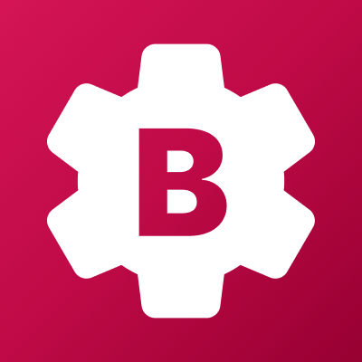
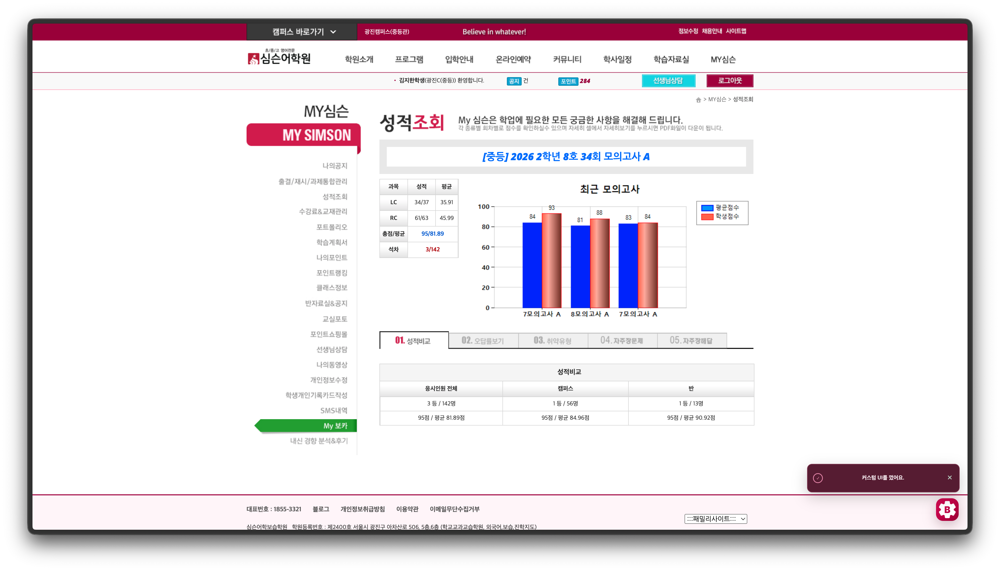
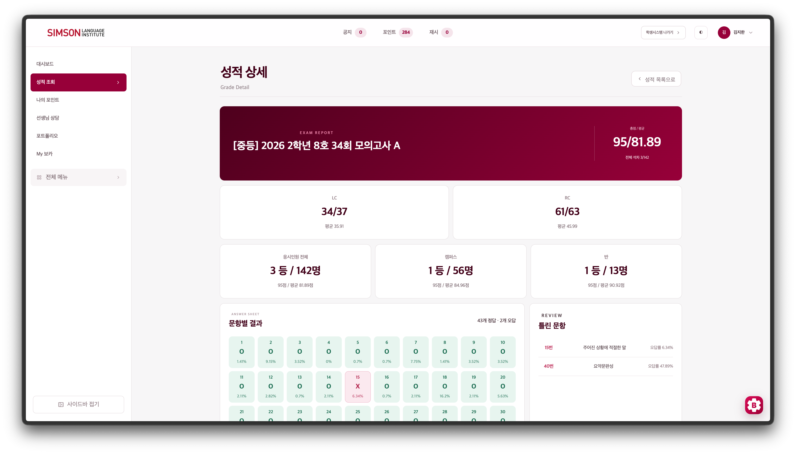
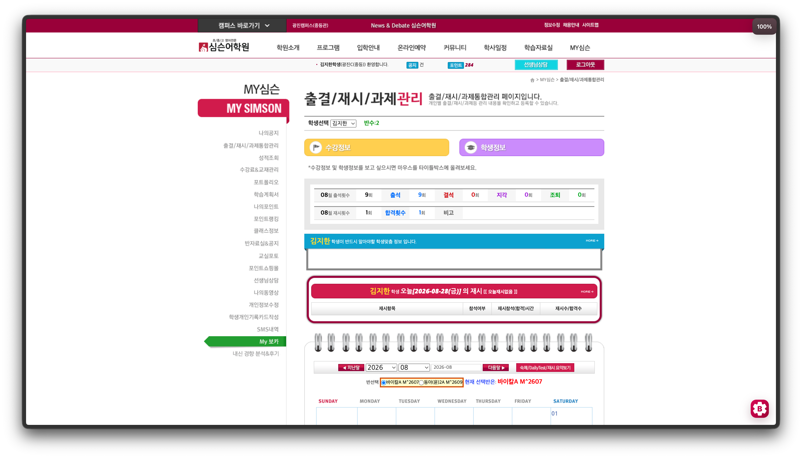
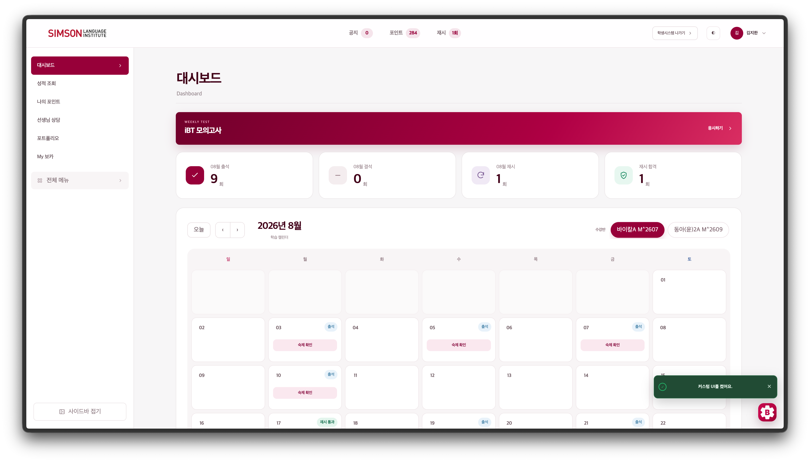
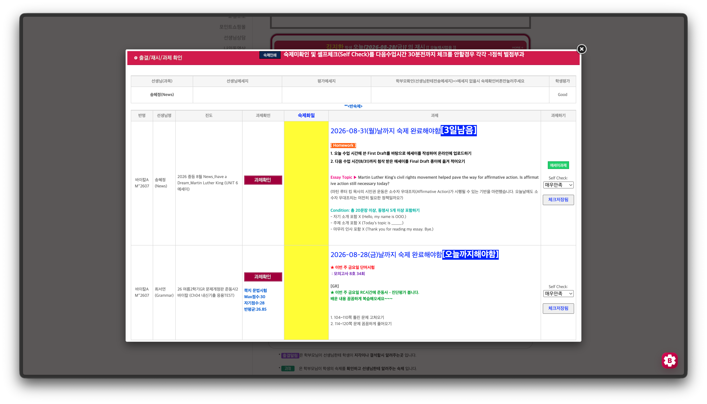
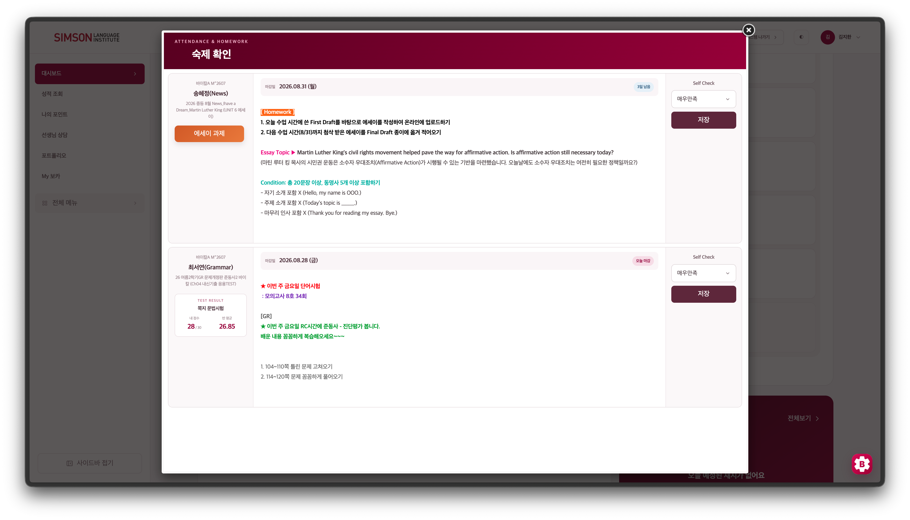

# Better Esimson

**오래된 심슨 웹사이트를 더 깔끔하고 편리하게.**

심슨어학원 웹사이트의 콘텐츠와 ASP.NET 기능은 그대로 유지하면서 
홈페이지와 학생시스템을 현대적인 화면으로 다시 구성하는 Chrome 확장 프로그램입니다.

 

---

## 무엇이 달라지나요?

- 심슨 홈페이지와 학생시스템을 브랜드 컬러 `#960139` 기반의 모던한 UI로 바꿉니다.
- 출결·숙제 캘린더, 성적 조회와 상세 분석, 포인트, 선생님 상담 등을 보기 쉽게 정리합니다.
- 원본 사이트의 데이터와 ASP.NET 동작을 유지하므로 기존 기능을 계속 사용할 수 있습니다.
- 새 디자인을 언제든 끄고 원본 화면으로 돌아갈 수 있습니다.
- 다크 모드, 자동 Self Check, 키보드 단축키와 첫 실행 온보딩을 제공합니다.

## Before & After

### 1. 홈페이지

| 기존 Simson | Better Esimson |
|:---:|:---:|
|  |  |

### 2. 학생시스템

| 기존 Simson | Better Esimson |
|:---:|:---:|
|  |  |

### 3. 학습 화면

| 기존 Simson | Better Esimson |
|:---:|:---:|
|  |  |

## 설치 방법

> Better Esimson은 현재 Chrome 웹 스토어가 아닌 GitHub 파일로 배포됩니다.

1. [Releases](https://github.com/z1hxn/Better-Esimson/releases/latest)에서 최신 ZIP 파일을 다운로드합니다.
2. 다운로드한 ZIP의 압축을 원하는 위치에 풉니다.
3. Chrome 주소창에 `chrome://extensions`를 입력합니다.
4. 화면 오른쪽 위의 **개발자 모드**를 켭니다.
5. **압축해제된 확장 프로그램을 로드합니다**를 누릅니다.
6. 압축을 푼 폴더에서 `manifest.json`이 들어 있는 폴더를 선택합니다.
7. [심슨어학원 홈페이지](https://www.esimson.com)를 새로고침합니다.

> 압축 파일 자체를 선택하면 설치되지 않습니다. 반드시 먼저 압축을 풀어 주세요.

## 업데이트 방법

웹 스토어를 사용하지 않기 때문에 업데이트는 수동으로 적용해야 합니다.

1. Releases에서 새 ZIP을 다운로드하고 압축을 풉니다.
2. 기존 Better Esimson 폴더의 파일을 새 파일로 교체합니다.
3. `chrome://extensions`에서 Better Esimson 카드의 **새로고침** 버튼을 누릅니다.

설정은 Chrome의 확장 프로그램 저장소에 보관되므로 같은 확장 ID가 유지되는 일반적인 업데이트에서는 그대로 남습니다.

## 주요 단축키

| 위치 | 키 | 동작 |
|---|:---:|---|
| 홈페이지 | `S` | 학생시스템 열기 |
| 학생시스템 | `1` | 대시보드 |
| 학생시스템 | `2` | 성적 조회 |
| 학생시스템 | `3` | 나의 포인트 |
| 학생시스템 | `4` | 선생님 상담 |
| 학생시스템 | `5` | 포트폴리오 |
| 학생시스템 | `6` | My 보카 |
| 학생시스템 | `M` | 학생시스템 나가기 |
| 전체 | `L` | 로그인 또는 로그아웃 |

입력창에 커서가 있을 때는 단축키가 실행되지 않습니다.

## 지원 범위

Better Esimson은 다음 화면을 중심으로 커스텀 UI를 제공합니다.

- 메인 홈페이지와 로그인 화면
- 학생시스템 대시보드 및 학습 캘린더
- 성적 조회, 시험 상세 결과와 자주장
- 나의 포인트와 포인트 랭킹
- 선생님 상담 목록과 상담 상세
- My 보카 및 관련 학습 도구
- 기타 `sub09_xx` 학생 페이지의 공통 헤더와 사이드바

전용 화면이 아직 없는 페이지에서도 원본 콘텐츠를 최대한 유지하며 Better Esimson 공통 레이아웃을 적용합니다.

## 참고

- 이 프로젝트는 심슨어학원의 공식 제품이 아닌 개인 제작 Chrome 확장 프로그램입니다.
- 로그인 정보와 사이트 데이터는 기존 심슨 웹사이트에서 처리합니다.
- 오류가 발생하면 플로팅 설정에서 **새 디자인**을 끄고 원본 화면을 사용할 수 있습니다.

---

Made with care by [@z1hxn](https://github.com/z1hxn) 
[GitHub 저장소](https://github.com/z1hxn/Better-Esimson)

